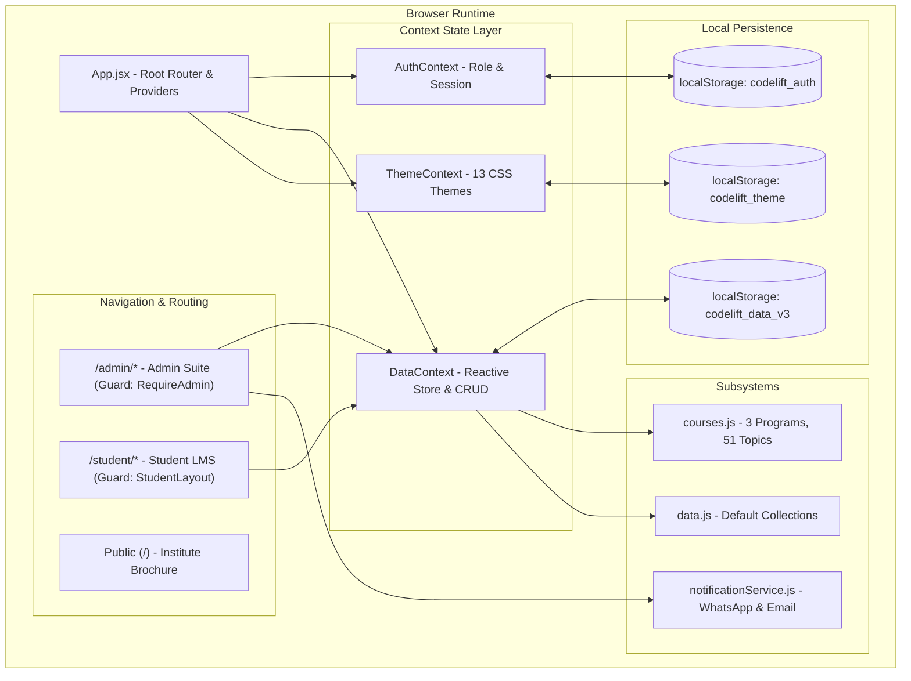

# CodeLift Platform – Comprehensive Technical Documentation

---

## 1. Executive Summary & System Overview

**CodeLift** is a full-featured educational institute management platform and learning management system (LMS). It is engineered as a **Local-First, Zero-Backend Single Page Application (SPA)** utilizing **React 18 + Vite + Bootstrap 5 + Framer Motion**.

The platform is divided into three core subsystems:
1. **Public Institute Portal** – Brochure-style educational landing page (strictly no e-commerce, warm institutional branding).
2. **Admin Management Suite** – Complete operational command center for batch scheduling, student enrollment, fee collections with WhatsApp receipts/reminders, test authoring, assignment review, certificate design/issuance, and unified JSON data backups.
3. **Student Learning Portal** – Interactive coursework viewer with markdown documentation, integrated MCQ assessments, assignment submission & grading viewer, fee ledgers, and digital credentialing with personal referral reward codes.

---

## 2. Technical Architecture & Design Decisions

### High-Level Architecture Diagram



### Key Architectural Tenets
- **Local-First & Resilient**: All operational data resides in reactive memory and synchronizes with `localStorage` under versioned key `codelift_data_v3`. Stale schemas from previous iterations (`codelift_admin_v2`, `codelift_bootstrap_v1`) are scrubbed automatically upon initialization.
- **Zero API Dependency**: The entire CRUD engine executes client-side. Operations are atomic, immutable, and notify activities to an audit log.
- **Client-Side Notification Generation**: Automated WhatsApp Web deep-links (`https://wa.me/`) and formatted email templates allow admins to dispatch fee receipts, payment reminders, grade evaluations, and certificates directly without requiring an SMS gateway or SMTP server.
- **Dynamic CSS Variable Theming**: Themes modify CSS custom properties on `:root` and `[data-theme]`, instantly updating colors, backgrounds, borders, and glassmorphism styling across all components.

---

## 3. Directory Structure

```text
e:/CodeLift/
├── dist/                          # Production build output
├── node_modules/                  # Installed dependencies
├── public/                        # Static assets (favicons, manifest)
├── src/
│   ├── components/
│   │   ├── admin/                 # Admin subsystem views
│   │   │   ├── BatchManager.jsx       # Cohort creation, capacity, active toggles
│   │   │   ├── CertificateDesigner.jsx# 3-template WYSIWYG studio, bulk issuance
│   │   │   ├── Dashboard.jsx          # KPI cards, revenue metrics, audit stream
│   │   │   ├── DataManager.jsx        # Unified JSON export, file upload restore
│   │   │   ├── FeeManager.jsx         # Tuition ledger, WhatsApp receipt/reminder
│   │   │   ├── GradingPanel.jsx       # Assignment authoring, submission grading
│   │   │   ├── ReviewManager.jsx      # Google-style testimonials, replies
│   │   │   ├── StudentManager.jsx     # Enrollment, batch assignment, profile edit
│   │   │   └── TestManager.jsx        # MCQ quiz creator, batch linking
│   │   ├── common/                # Shared layout & UI primitives
│   │   │   ├── AdminSidebar.jsx       # Compact navigation component
│   │   │   ├── Animations.jsx         # PageTransition, AnimatedCard, CountUp
│   │   │   ├── InstituteNavbar.jsx    # Sticky public navigation bar
│   │   │   ├── Layout.jsx             # Admin container with animated closable sidebar
│   │   │   ├── NotificationModal.jsx  # WhatsApp & Email preview modal
│   │   │   └── Sidebar.jsx            # Admin sidebar navigation links
│   │   └── student/               # Student subsystem views
│   │   │   ├── StudentAssignments.jsx # Project submission & grade viewer
│   │   │   ├── StudentCertificates.jsx# Credential view, PDF print, referral code
│   │   │   ├── StudentCourses.jsx     # Markdown reader, topic completion, quiz CTA
│   │   │   ├── StudentDashboard.jsx   # Enrolled course tracker, upcoming tests
│   │   │   ├── StudentFees.jsx        # Personal payment ledger & pending dues
│   │   │   ├── StudentLayout.jsx      # Student portal layout with dedicated nav
│   │   │   └── StudentTests.jsx       # MCQ exam taker with auto-scoring
│   ├── contexts/
│   │   ├── AuthContext.jsx        # Admin/Student authentication state
│   │   ├── DataContext.jsx        # Reactive database store with 11 collections & CRUD
│   │   └── ThemeContext.jsx       # 13 color palettes & dark mode state
│   ├── data/
│   │   ├── courses.js             # Comprehensive curriculum (Python, FE, Analytics)
│   │   └── data.js                # Initial seed data for all collections
│   ├── pages/
│   │   ├── AdminRoutes.jsx        # Protected route wrapper for admin users
│   │   ├── Home.jsx               # Public institute landing page
│   │   └── Login.jsx              # Dual login portal (Admin password / Student select)
│   ├── services/
│   │   └── notificationService.js # Formatted templates & WhatsApp URL builder
│   ├── App.jsx                    # Top-level routing, ErrorBoundary & Toast provider
│   ├── index.css                  # Bootstrap overrides, 13 themes, glassmorphism
│   └── main.jsx                   # React application mount point
├── package.json                   # Dependencies and npm scripts
├── vite.config.js                 # Vite bundling configuration
└── README.md                      # Project summary & setup instructions
```

---

## 4. State Management & Data Schemas

All collections are maintained in `DataContext.jsx` and initialized from `data/data.js` and `data/courses.js`.

### 4.1 Collection Schemas

#### Batches (`batches`)
```typescript
interface Batch {
  id: string;              // e.g. "batch-fswd-morning"
  name: string;            // e.g. "Full Stack Web Dev (Morning)"
  description?: string;
  startDate: string;       // ISO Date string
  feeAmount: number;       // Base tuition fee (e.g. 35000)
  capacity: number;        // Maximum seat limit (default: 30)
  isActive: boolean;       // Status toggle
}
```

#### Students (`students`)
```typescript
interface Student {
  id: string;              // e.g. "student-rahul"
  name: string;            // e.g. "Rahul Sharma"
  email: string;           // Unique email identifier
  phone: string;           // E.164 phone or 10-digit Indian mobile
  batchId: string;         // Foreign key referencing Batch.id
  joinedAt: string;        // Enrollment timestamp
  isActive: boolean;       // Active enrollment status
  progress: Record<string, 'completed' | 'in-progress'>; // Map of topic IDs
}
```

#### Fees (`fees`)
```typescript
interface Fee {
  id: string;              // Unique transaction reference
  studentId: string;       // Foreign key referencing Student.id
  amount: number;          // Payment installment (e.g. 15000)
  paidAt: string;          // Payment date (YYYY-MM-DD)
  dueDate?: string;        // Installment deadline
  mode: 'Cash' | 'UPI' | 'Bank Transfer';
  status: 'PAID' | 'PENDING';
}
```

#### Courses (`courses`)
```typescript
interface Course {
  id: string;              // e.g. "course-python"
  title: string;           // "Python Full Stack Development"
  description: string;
  batchId: string;         // Linked cohort batch ID
  modules: {
    id: string;            // e.g. "py-mod-1"
    title: string;         // "Python Basics"
    testId?: string;       // Linked examination test ID
    topics: {
      id: string;          // e.g. "py-t1"
      title: string;
      contentMd: string;   // Full markdown lesson content with code blocks
    }[];
  }[];
}
```

#### Tests & Quizzes (`tests`)
```typescript
interface Test {
  id: string;              // e.g. "test-python-basics"
  title: string;
  description: string;
  moduleId?: string;       // Linked module foreign key
  assignedBatchIds: string[];
  createdAt: string;
  questions: {
    id: string;
    text: string;
    options: string[];     // 4 multiple-choice options
    correctAnswer: number; // 0-indexed index of correct choice
  }[];
}
```

#### Test Attempts (`testAttempts`)
```typescript
interface TestAttempt {
  id: string;
  testId: string;
  studentId: string;
  score: number;           // Total correct answers
  totalQuestions: number;
  percentage: number;
  attemptedAt: string;
}
```

#### Assignments & Submissions (`assignments`, `submissions`)
```typescript
interface Assignment {
  id: string;
  title: string;
  description: string;
  deadline: string;
  maxMarks: number;
  batchIds: string[];
  createdAt: string;
}

interface Submission {
  id: string;
  assignmentId: string;
  studentId: string;
  fileUrls: string[];
  submittedAt: string;
  grade: number | null;    // Numerical marks awarded
  feedback: string | null; // Qualitative instructor feedback
}
```

#### Certificates (`certificates`)
```typescript
interface Certificate {
  id: string;
  studentId: string;
  studentName: string;
  courseName: string;
  issuedAt: string;
  certificateId: string;   // e.g. "CERT-2026-0001"
  isRevoked: boolean;
}
```

#### Reviews (`reviews`)
```typescript
interface Review {
  id: string;
  studentName: string;
  courseName: string;
  rating: number;          // 1 to 5 stars
  comment: string;
  isPublished: boolean;
  reply: string | null;
  createdAt: string;
}
```

---

## 5. Security & Authentication Architecture  

Authentication is governed by `AuthContext.jsx` and backed by `localStorage` (`codelift_auth`).

### Dual Authentication Model
1. **Admin Authentication**:
   - Username: `admin`
   - Password: Password protected with validation.
   - Grants access to `/admin/*` routes wrapped by `RequireAdmin`.
2. **Student Authentication**:
   - Fast multi-student switcher simulating single sign-on (SSO).
   - Allows students to log in and access their personal batch curriculum, fee balance, and grades without entering credentials repeatedly in development.

### Route Guarding
```javascript
// AdminRoutes.jsx
export function RequireAdmin() {
  const { isAdmin } = useAuth();
  if (!isAdmin) return <Navigate to="/login" replace />;
  return <Layout />;
}
```

---

## 6. Subsystem Deep-Dive

### 6.1 Admin Panel Subsystem

#### 1. Executive Dashboard (`Dashboard.jsx`)
- **Metric KPIs**: Real-time cards displaying Total Active Students, Active Cohorts, Collected Revenue, and Published Tests.
- **Audit Stream**: 50 most recent actions (payments, enrollments, grading, certificate issuances) with timestamps and formatted messages.
- **Quick Actions**: One-click navigation to record payments or create cohorts.

#### 2. Student Management (`StudentManager.jsx`)
- Filter students by batch, search by name or email.
- Modal to register new students with initial batch assignment.
- Quick profile editing and active/inactive status toggle.

#### 3. Batch Management (`BatchManager.jsx`)
- Set tuition fees, seat capacity, and schedule start dates.
- Cohort archiving and capacity utilization progress bars.

#### 4. Fee Management & Receipts (`FeeManager.jsx`)
- Reconcile payments across Cash, UPI, and Bank Transfer.
- Pending balance filtering to highlight overdue students.
- **Send Receipt Button**: Generates a receipt and opens the WhatsApp modal for paid fees.
- **Send Reminder Button**: Generates a balance reminder with due date and institute UPI ID for pending fees.

#### 5. Assignment Manager (`GradingPanel.jsx`)
- Publish briefs targeted to specific batches with deadlines.
- Queue of student submissions with file inspect links.
- Grade scoring modal with qualitative notes and **Notify** button to alert the student via WhatsApp.

#### 6. Certificate Studio (`CertificateDesigner.jsx`)
- **WYSIWYG Template Switcher**: Choose between 3 active styles:
  - *Classic Academy*: Traditional green borders, Georgia serif typography.
  - *Modern Executive*: Dark gradient palette, mint accents, sans-serif typography.
  - *Honorary Distinction*: Regal purple styling with honor seals.
- **Live Canvas Preview**: Real-time rendering of certificate text, signatures, and credentials.
- **Referral Code Generator**: Automatically computes `LIFT-<NAME>2026` granting a ₹500 discount.
- **Bulk Cohort Issuance**: Issues certificates to an entire batch simultaneously.

#### 7. Unified Data Manager (`DataManager.jsx`)
- **Export Backup**: Downloads a full snapshot of all 11 collections as `codelift-backup-YYYY-MM-DD.json`.
- **Import Restore**: Upload a `.json` file or paste raw JSON. Validates schema and updates reactive state.
- **Factory Reset**: Discards local edits and re-seeds default data.

---

### 6.2 Student Portal Subsystem

#### 1. Course Viewer (`StudentCourses.jsx`)
- Left sidebar module and topic list with completion status ticks.
- Custom Markdown Renderer supporting code blocks, tables, bold/italic, lists, and headers without external dependencies.
- **"Mark Complete"** button to track topic progress.
- **"Take Module Test"** CTA button linking directly to the module's exam quiz.

#### 2. Test Examination Engine (`StudentTests.jsx`)
- Displays available tests matching the student's batch.
- Interactive question-by-question MCQ examination.
- Automatic score computation, percentage calculation, and result history saving.

#### 3. Assignments (`StudentAssignments.jsx`)
- Displays active coursework briefs and submission status.
- File upload/URL submission form.
- Evaluated grade badge and mentor feedback display.

#### 4. Certificates & Referral Rewards (`StudentCertificates.jsx`)
- Displays issued certificates with high-resolution Print / Save PDF view.
- **Referral Reward Card**: Displays the student's personal `LIFT-XXXX2026` referral code with a one-click copy button.

---

### 6.3 Notification Service Architecture

Implemented in `src/services/notificationService.js`, the notification engine creates dual-channel notifications:

1. **WhatsApp Web Deep Link**:
   ```javascript
   const cleanPhone = phone.replace(/\D/g, '');
   const url = `https://wa.me/${cleanPhone}?text=${encodeURIComponent(message)}`;
   ```
2. **Formatted Email Template**:
   Subject line and pre-formatted body ready for standard email clients (`mailto:`).
3. **Interactive Modal** (`NotificationModal.jsx`):
   Allows admins to preview the message, copy text to clipboard, or launch WhatsApp in a new tab.

---

## 7. Theme Engine & Styling System

The application features **13 built-in themes** managed through `ThemeContext.jsx` and configured in `index.css`:

### 10 Light Themes
1. **Forest Green (Default)** (`#15803D`)
2. **Emerald & White** (`#059669`)
3. **Dark Green / Black** (`#065F46`)
4. **Navy Blue** (`#1E3A8A`)
5. **Indigo & Gray** (`#4338CA`)
6. **Teal** (`#0D9488`)
7. **Warm Amber** (`#D97706`)
8. **Rose** (`#BE123C`)
9. **Purple** (`#6D28D9`)
10. **Neutral Gray** (`#1F2937`)

### 3 Premium Dark Themes
11. **Dark Emerald** (`#10B981` primary on `#0F172A` deep navy)
12. **Dark Nebula** (`#8B5CF6` primary on `#0B0F19` space black)
13. **Dark Carbon** (`#6EE7B7` mint on `#000000` pitch black)

### CSS Variables Applied
```css
[data-theme="dark-emerald"] {
  --bs-primary: #10B981;
  --bs-primary-rgb: 16, 185, 129;
  --bg-body: #0F172A;
  --card-bg: #1E293B;
  --text-primary: #F1F5F9;
  --text-secondary: #94A3B8;
  --border-color: #334155;
  --glass-bg: rgba(30, 41, 59, 0.8);
}
```

### Course & Curriculum View Theme Harmonization
All course-facing screens (`CourseDetail.jsx`, `CourseView.css`, `CurriculumNavigator.jsx`, `StudentCourses.jsx`, `TopicQuiz.jsx`) dynamically adapt to all 13 themes:
- Replaced hardcoded `#fff` and `rgba(255,255,255,...)` with semantic variables `var(--text-primary)`, `var(--text-secondary)`, `var(--card-bg)`, and `var(--card-bg-alt)`.
- Replaced hardcoded `#166534` green gradients with `color-mix(in srgb, var(--bs-primary) 80%, #000)`, ensuring brand consistency across red, amber, teal, purple, navy, and dark themes.
- Replaced `[data-theme="dark"]` selectors with `[data-bs-theme="dark"], [data-theme-mode="dark"], [data-theme*="dark"]` for complete compatibility.

---

## 8. Institutional Fee Resolution Engine (`feeUtils.js`)

Tuition fees are dynamically resolved by cross-referencing attached institutional batches (`batches` from `DataContext`):
```javascript
import { resolveCourseFee } from '../utils/feeUtils';

const feeInfo = resolveCourseFee(course, batches);
// feeInfo: { isFree, price, feeAmount, feeFormatted, originalPrice, batchName }
```
- **Batch Cross-Referencing**: When an admin updates batch tuition fees in institutional batch management (e.g. ₹45,000 for Full Stack Web Dev, ₹35,000 for Data Analytics), the changes are reflected across the Home Cohorts section, Course Marketplace, Course Detail page, and WhatsApp enrollment modals.
- **WhatsApp Pre-Filled Text**: Guarantees that when a prospective student clicks "Enroll via WhatsApp", the dispatched message contains the true tuition fee rather than legacy placeholder pricing.

---

## 9. Build & Verification Instructions

### Prerequisites
- Node.js version 18+ or 20+
- npm version 9+

### Installation
```bash
cd e:/CodeLift
npm install
```

### Development Server
```bash
npm run dev
```
Access the application at `http://localhost:5173`.

### Production Build
```bash
npm run build
```
Vite compiles the single-page application into `/dist` (797 modules transformed, ~825 kB minified JS).

### Production Preview
```bash
npm run preview
```

---

## 9. Verification & Maintenance Checklist

| Checkpoint | Target Behavior | Verification Result |
|---|---|---|
| **Build Stability** | Clean compilation with 0 syntax errors | `✓ built in 6.18s` |
| **Activity Feed** | Uses `message` & `createdAt` schema | No `startTime` undefined exceptions |
| **Data Migration** | Scans and merges extended curriculum | Fresh topics always hydrate on reload |
| **WhatsApp Links** | Generates valid `https://wa.me/` URLs | Opens chat tab with pre-filled text |
| **Certificates** | Renders live canvas in 3 distinct templates | Instant reactive updates on field changes |
| **Backup Integrity** | Exports all 11 collections into JSON | Re-import validates and updates state |
| **Responsive Layout** | Desktop sidebar collapses; mobile uses offcanvas | Tested across desktop and mobile screens |
